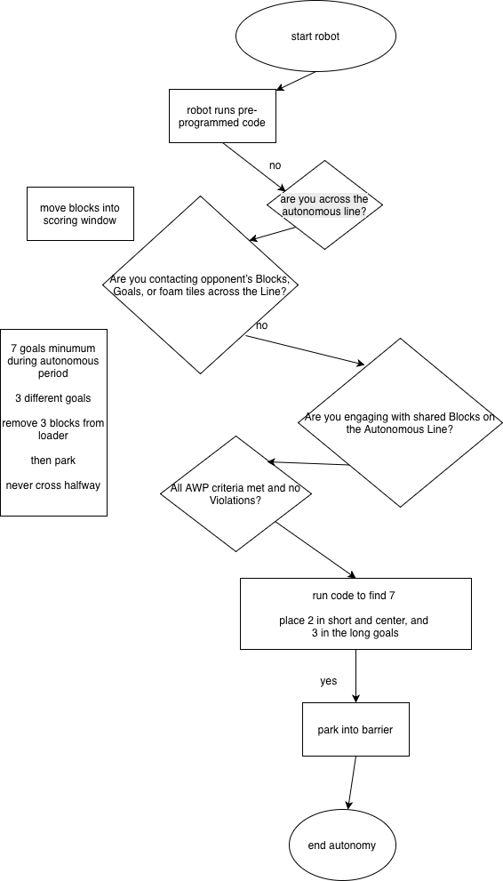

# vex-pushback-2025-2026
Official repository for LSC-CyFair's Robotics Club

Team Name: ???
Team Members (type your name here):
Tyler Lacy, 
Competition Name: Vex v5 U Pushback 2025-2026

Welcome to the readme of the LSC-CF robotics vex pushback comp.
This is designed to be your go-to if you're getting the robot to run.

(team members from previous vex comps please feel free to edit this to make sense)

1. So ur gonna download this code and run it on your robots

2. upload the code via micro usb with vs code to the brain.

3. eject the usb.

4. select your program on the graphical user interface.

5. Then click run.

rough draft of flowcchart:

  

